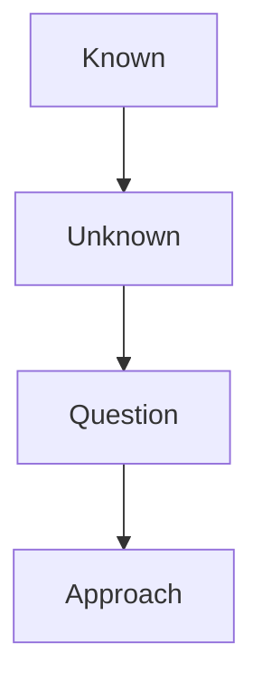
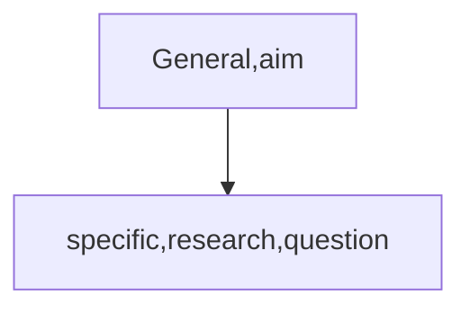

# Introduction
## Function&Structure
**Aim of the research**
Justify question and approach
### How do you justify your research
Readers need to know 
* where the research question comes from
* why the researcher is asking this question
* why the researcher is using this approach to answer the question

* Known 
* unknown
* question
* approach

### Story of introduction

#### Structure
* **Opening**
    The opinion introduces the topic, establishes significance and identifies the large issue addressed.
1. Establish significance(*general->specific*)
2. Background/keywords
3. Identify problem area/current research focus
* **Funnel(O-A)**
Where research come from
Why research is need
The research question is inevitable
 1. Connect
 1. frame
 2. Knowledge
 3. Gap
 * **Literature**
 1. Published research article
 2. Reviewed

*  3basic way to cite

1. Information prominent
2. Author prominent
3. Weak author prominent
* Citation and verb tense

Wolong Nature Reserve contains 10% of the wild panda population(Marshall,2015.)#1
Human activity continues within the Wolong Nature reserve.(Sampson et al.,2013)#2
Wolong Nature Reserve contains 200000 hectares of suitable panda habitat(Zhang et al,.1989) 

The suitability of habitat for pandas has been wild analyzed(Caro et al.,1998;liu,li et al.,2001).
Previous research has used remotely sensed data to quantify changes in forest cover(liles,kiefer.,1990;zhang et al.,2012).
Previous research has divided panda habitat suitability into four categories: highly suitable, suitable, marginally suitable, and unsuitable.(morrison…et al.)
**how organize the funnel**
The suitability of habitat for pandas has been wild analyzed(Schaller,1994;Van Schaik and Johnson,1997;)Ecological quality can be defined as suitability for panda habitat(Schaller,1994). And the ecological quality of panda habitat in terms of amount of panda habitat has been examined(Schaller,1994).The suitability of habitat in terms of number of habitat patches has been estimated(Van Schaik and Johnson,1997).The previous research has measured mean patch size to determine suitability(Liu et al.,1999).And the previous research has used remotely sensed data to quantify changes in forest cover(Lilles and Kiefer,1990).  
* **Aim**
* Stating the aim
1. Question
    * the question must be precise
    * **signal the question**
    * in this study we asked whether
    * here we investigate
    * the purpose of this study is to determine whether
    * in this report we tested the hypothesis
    * **verbs for the question**
    
2. Experimental approach
3. Prediction

    1. Where is the aim located?
        * end of the introduction
    2. Why don’t we put the aim in the beginning?
        * aim should come from known and unknown;imitate scientific process
    3. What is describe

Here we investigate whether the ecological quality of the wolong nature reserve improved after it was established.
To investigate it, we use remote sensing data from 1975-2018, and measure total habitat area, mean patch size, patch number.

### Identify knowledge gaps
**Stating the unknown**

**signal words for the knowledge gap**

|sare |despite its acknowledge | 
|-|-|
|but||

**The negative opening**
| countable   | uncountable   |
| ----------- | ------------- |
| Research    | attempt       |
| Work        | researcher    |
| Attention   | study         |
| Information | investigation |
1. However, little research has examined the effect of asthma on long-term lung function
2. However, few researchers has looked at the selection of an appropriated rubber component in copolymer system x.
3. However, few studies identified stars not bound to the milky way.
4. However, little work has explored the hypothesis that eduction enhances decision-making.
**Using contrastive statements to identify the knowledge gap**
**Although**
1. Although genetic factors contribute to almost half of the cases of deafness, treatment options for genetic deafness are limited.
2. Although some researchers propose that upper-face movements in the “fear” grasping face were adaptions to enhance vision, these findings have been limited to western societies.
3. Although there is no ’magic bullet’ that can completely conquer cancer, many types of the disease might be avoidable.
**Despite**
After despite, we use a noun, a pronoun or -ing
1. Despite the contribution of genetic factors to almost half of all cases of deafness, treatment options for genetic deafness are limited. 
2. Despite great progress in the area of leukemia research, medicine delivery is ineffcient.
3. Despite the importance of wildlife conservation, humans continue to destroy habitats.
4. Despite the role of carbon dioxide emissions in climate change, few policies have been enacted to reduce fossil duel consumption.

* However, few researchers compare ecological quality…
* Although remote sensing data can be used to measure habitat area, mean size Etc., few researchers has used three measures for ecological quelity in one study.
* Despite the  