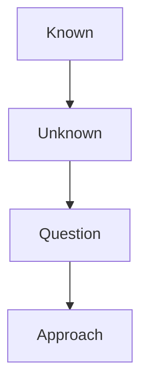
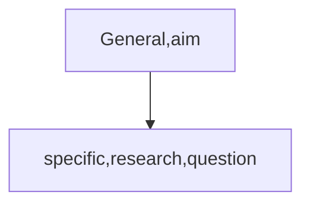

# Introduction
## Function&Structure
**Aim of the research**
Justify question and approach
### How do you justify your research
Readers need to know 
* where the research question comes from
* why the researcher is asking this question
* why the researcher is using this approach to answer the question

* Known 
* unknown
* question
* approach

### Story of introduction

#### Structure
* **Opening**
    The opinion introduces the topic, establishes significance and identifies the large issue addressed.
1. Establish significance(*general->specific*)
2. Background/keywords
3. Identify problem area/current research focus

key term and big issue
key term: biology 
big issue: we want to understand whether protected area could increase ecological quality.
1. fundamental
2. a crucial issue
3. the past ten years
4. extensively
5. key
protected area has played a key role in ecology.

1. unserstand
2. remains unstudied
3. understand

However understanding how protected area effect the wild animals remians a major challenge in ecology. 
* quantiity:widely recognized;traditionally;extensively studied; over the past ten years
* useful:useful method;extensively studied
* money:economic costs;substantial costs;fundametal
* important:key technique;crucial issue;over the past ten years;

* **Funnel(O-A)**
Where research come from
Why research is need
The research question is inevitable
 1. Connect
 1. frame
 2. Knowledge
 3. Gap
 * **Literature**
 1. Published research article
 2. Reviewed

*  3basic way to cite

1. Information prominent
2. Author prominent
3. Weak author prominent
* Citation and verb tense

Wolong Nature Reserve contains 10% of the wild panda population(Marshall,2015.)#1
Human activity continues within the Wolong Nature reserve.(Sampson et al.,2013)#2
Wolong Nature Reserve contains 200000 hectares of suitable panda habitat(Zhang et al,.1989) 

The suitability of habitat for pandas has been wild analyzed(Caro et al.,1998;liu,li et al.,2001).
Previous research has used remotely sensed data to quantify changes in forest cover(liles,kiefer.,1990;zhang et al.,2012).
Previous research has divided panda habitat suitability into four categories: highly suitable, suitable, marginally suitable, and unsuitable.(morrison…et al.)
**how organize the funnel**

Protected areas are traditionally methods to protect the endangered animals. Researchers assume that protect areas are important for conserving ecological quality. During past decades, over 12,000 protected areas were established. These protected areas have reached 13.2 million km2, which occupy the 8.8% of Earth's land surface. Recents years human activities threaren protected areas.These activites cause decrease of protected area. However, the ecologicl quality changing in protected area is still not well understood.

Wolong Nature Reserve was established in 1975, which is the largestprotected area of giant panda conservation. Wolong is in Sichuan Province ,southwestern China. Wolong Nature Reserve contains 10% of the wild panda population(Marshall,2015.).However,few studies compared ecological quality before and after it was established.

Ecological quality can be defined as suitability for panda habitat(Schaller,1994). The suitability of habitat for pandas has been wild analyzed(Schaller,1994;Van Schaik and Johnson,1997;)And the ecological quality of panda habitat in terms of amount of panda habitat，number of habitat patches and mean patch size have been examined ( Schaller,1994;Van Schaik and Johnson,1997;Liu et al.,1999 ).And the previous research has used remotely sensed data to quantify changes in forest cover(Lilles and Kiefer,1990).  

To investigate whether ecological quality of the Wolong Nature Reserve improved after it was established, we use remote sensing data from 1975-2018, and measure total habitat area, mean patch size, patch number in Wolong Nature Reserve.
* **Aim**
* Stating the aim
1. Question
    * the question must be precise
    * **signal the question**
    * in this study we asked whether
    * here we investigate
    * the purpose of this study is to determine whether
    * in this report we tested the hypothesis
    * **verbs for the question**
    
2. Experimental approach
3. Prediction

    1. Where is the aim located?
        * end of the introduction
    2. Why don’t we put the aim in the beginning?
        * aim should come from known and unknown;imitate scientific process
    3. What is describe

Here we investigate whether the ecological quality of the wolong nature reserve improved after it was established.
To investigate it, we use remote sensing data from 1975-2018, and measure total habitat area, mean patch size, patch number.

### Identify knowledge gaps
**Stating the unknown**

**signal words for the knowledge gap**

|sare |despite its acknowledge | 
|-|-|
|but||

**The negative opening**
| countable   | uncountable   |
| ----------- | ------------- |
| Research    | attempt       |
| Work        | researcher    |
| Attention   | study         |
| Information | investigation |
1. However, little research has examined the effect of asthma on long-term lung function
2. However, few researchers has looked at the selection of an appropriated rubber component in copolymer system x.
3. However, few studies identified stars not bound to the milky way.
4. However, little work has explored the hypothesis that eduction enhances decision-making.
**Using contrastive statements to identify the knowledge gap**
**Although**
1. Although genetic factors contribute to almost half of the cases of deafness, treatment options for genetic deafness are limited.
2. Although some researchers propose that upper-face movements in the “fear” grasping face were adaptions to enhance vision, these findings have been limited to western societies.
3. Although there is no ’magic bullet’ that can completely conquer cancer, many types of the disease might be avoidable.
**Despite**
After despite, we use a noun, a pronoun or -ing
1. Despite the contribution of genetic factors to almost half of all cases of deafness, treatment options for genetic deafness are limited. 
2. Despite great progress in the area of leukemia research, medicine delivery is ineffcient.
3. Despite the importance of wildlife conservation, humans continue to destroy habitats.
4. Despite the role of carbon dioxide emissions in climate change, few policies have been enacted to reduce fossil duel consumption.

* However, few researchers compare ecological quality…
* Although remote sensing data can be used to measure habitat area, mean size Etc., few researchers has used three measures for ecological quelity in one study.
* Despite the  

Our Aims
goals: I want to learn about how to make the researcher article more easier to understand to other researchers who are not in the same field.

an improved

What did we do?
1. basic building blocks of writing
	1. word choice
	2. paragraph cohesion
	3. sentence structure
2. writing research articles
	1. analyze different senctions of research article
	2. writing
3. necessary words
	1. eliminate redundant words
		1. avoid phrases that add unnecessary length
		2. make subjects short and concrete
		3. avoid interrupting subject and verb with more than a word or two
		4. put key action in the verb, not in nouns
		5. put familiar information at beginning of sentence, new information at the end.

There was a very strong positive correlation by the analysising of rate of change and earthquake magnitude.
An increasing in the number of UFO in the week before the earthquake can be seen in four countries(Russia,Australia,America,Canada).
UFO sightings changes a lot one week prior to an earthquake.
The  change in UFO sightings was positivitely correlated with earthquake magnitude.
The number of UFO sighting increased in the week before earthquake in 4 countries.

Two Types of Results sections
1. all experiments designed in advance
	1. just results
		1. state key result
		2. locate the figure or table
		3. support with evidence
2. one experiment determines the next
	1. sequential results
		1. question
		2. overview of experiments
		3. results
		4. answer to the question

model
1. opioning(key words1 )
2. research question
	1. experimental approach
3. state result
4. disscussion
5. predicted(big issue)

Human activities is a strong influence factor to the natural plant, . To invesigate whether human harvesting has selected for smaller plants in the rare Tibetan snow lotus, Saussure laniceps, the researchers measure the height of the rare Tibetan snow lotus, Saussure laniceps and the S. medusa over the hundred years. In the experiments, S.laniceps size decreased over the past 100 years and the S. medusa size was unchanged over the past 100 years. This results indicate that human harvesting has selected for smaller plants in the rare Tibetan snow lotus, Saussure laniceps.Futher, our finding imply that anthropogenic activities lead to evolutionary changes in natural plant populations.